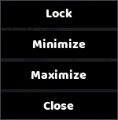
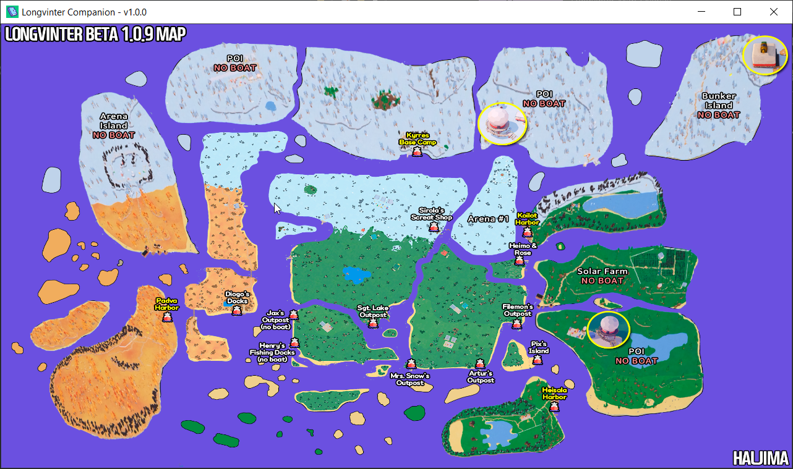
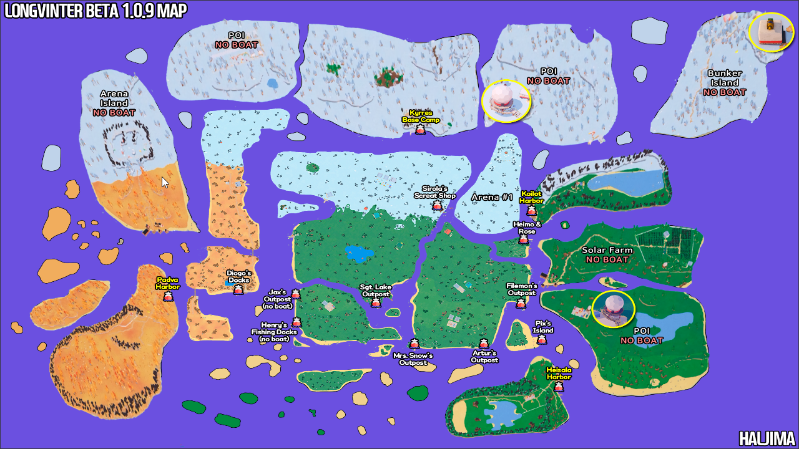

# Longvinter Map Overlay

## Description

This app, currently titled Longvinter Companion, displays an overlay of the Longvinter Map that you can use for reference while playing the game.

## Getting Started

To get started, just download the latest release (**LongvinterCompanion-1.0.0.zip**) and extract it to a folder. The only files you need are the **.exe** and the **assets** folder. Once you've verified those are in place, you can double click the .exe file to run the app.

### The Context Menu

When you right click anywhere on the image, you will get a small popup window that appears with several options, this is known as a context menu.

The options are:
1. **Lock/Unlock**
2. **Minimize**
3. **Maximize/Restore**
4. **Close**

**Minimize**, **Maximize/Restore**, and **Close** are all self explanatory, they function exactly like the 3 buttons at the top right of every window. **Lock/Unlock** is used to change the app state between **Locked/Unlocked**.

**Unlocked**

- Header is visible
- Window is resizable

**Locked**

- Header is not visible
- Window is not resizable

This feature exists so you can **Unlock** the window when you want to resize it, and once you decide on a size you like, you can then get rid of that ugly white bar at the top by clicking **Lock**.